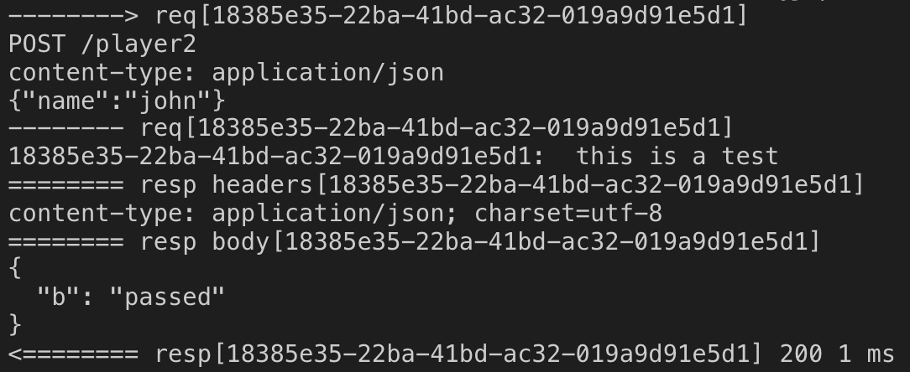

# log-express-middleware
日志打印中间件



# Install
```
$ npm install @zhike/log-express-middleware
```

# Example
```
const logger = require('@zhike/log-express-middleware')
const Express = require('express')

const app = new Express()

//只打印requestBody
app.use(logger())

// 打印所有路径的headers中的content-type。只打印以/player2开头的路径的responseBody
app.use(logger({
    requestHeaders: ['content-type'],
    responseHeaders: ['content-type'],
    responseBodyWhiteList: ['/^\/player2/']
}))
```

## Configuration Options
| 参数名                 | 类型                          |  说明  |
| --------              | -----                         | ------ |
| reqId                    | String                           | 响应标识id(使用自定义的reqId需放在日志中间件前。如果为空且ctx.reqId为空则使用uuidv4自动生成reqId)                            |
| requestHeaders | Array                      | 需要打印的request头部   (默认不打印)            |
| responseHeaders | Array                      | 需要打印的response头部 (默认不打印)                 |
| responseBodyWhiteList               | Array                           | 白名单,字符串数组，可为正则(对于正则匹配剔除部分路由,可在业务代码中的ctx.useResponseBodyOption=false跳过路由规则)                            |
| responseBodyBlackList       | Array                           | 黑名单,字符串数组,可为正则(对于正则匹配剔除部分路由,可在业务代码中使用ctx.useResponseBodyOption=false跳过路由规则)                      |

注意： 
1. 必会打印reqId,路径，方法，响应时间。
2. 默认打印requestBody。
3. 默认不打印responseBody。
4. responseBodyWhiteList和不能和responseBodyBlackList同时传值
5. responseBodyWhiteList和responseBodyBlackList暂未支持同一path不同method,后续会完善。